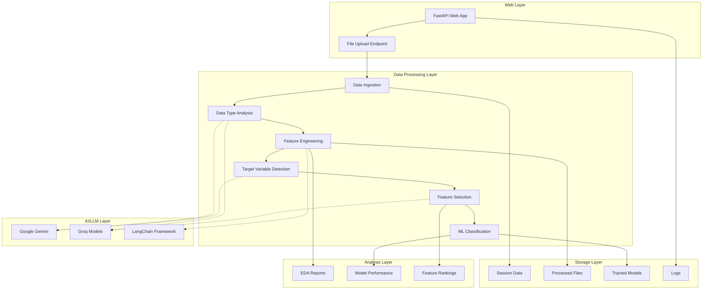
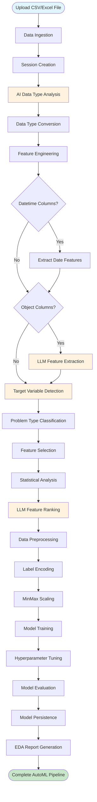

# AutoML Project

An automated machine learning (AutoML) framework built with Python that simplifies the process of data ingestion, analysis, and model building.


## System Architecture



## Workflow Diagram



## Features

- **FastAPI Web Application**: RESTful API for file upload and processing
- **Data Ingestion**: Automated CSV/Excel file handling with session management
- **AI-Powered Data Type Analysis**: LLM-based intelligent data type inference and conversion
- **Automated Feature Engineering**: Complete pipeline for feature extraction and datetime processing
- **Target Variable Detection**: AI-powered identification of target variables and problem types
- **Intelligent Feature Selection**: Statistical and LLM-based feature selection for ML models
- **Automated ML Classification**: Complete classification pipeline with multiple algorithms and hyperparameter tuning
- **Exploratory Data Analysis**: Automated HTML report generation with comprehensive data insights
- **Multi-LLM Support**: Integration with Google Gemini and Groq models
- **Custom Logging**: Structured logging with JSON output and file/console handlers
- **Exception Handling**: Custom exception handling with detailed error tracking
- **Session Management**: Unique session IDs for data isolation and tracking
- **Configuration Management**: YAML-based configuration system

## Project Structure

```
automl/
├── app/
│   └── main.py                     # Main application entry point
├── src/
│   ├── datasetAnalysis/
│   │   ├── data_ingestion.py       # Dataset handling and CSV/Excel processing
│   │   └── data_type_analysis.py   # AI-powered data type analysis
│   ├── dataCleaning/
│   │   └── featureEngineering01.py # Automated feature engineering pipeline
│   ├── problem_statement/
│   │   ├── target_variable.py      # AI-powered target variable identification
│   │   └── AutoFeatureSelector.py  # Intelligent feature selection for ML
│   ├── Classifier/
│   │   └── MLClassifier.py         # Automated ML classification with multiple algorithms
│   └── data_dashboard/
│       └── eda.py                  # Exploratory data analysis and HTML report generation
├── model/
│   └── models.py                   # Pydantic models for data validation
├── utils/
│   ├── model_loader.py             # LLM and embedding model loader
│   └── config_loader.py            # Configuration management
├── Propmt/
│   └── propmt_lib.py               # LLM prompt templates
├── config/
│   └── config.yml                  # Application configuration
├── logger/
│   └── customlogger.py             # Custom structured logging
├── expection/
│   └── customExpection.py          # Custom exception handling
├── data/                           # Data storage directory
├── logs/                           # Application logs
├── .env                            # Environment variables
└── requirements.txt                # Project dependencies
```

## Installation

1. Clone the repository:
```bash
git clone <repository-url>
cd automl
```

2. Install dependencies:
```bash
pip install -r requirements.txt
```

3. Install the package in development mode:
```bash
pip install -e .
```

## Dependencies

- **FastAPI & Uvicorn**: Web framework and ASGI server
- **Pandas & NumPy**: Data manipulation and analysis
- **Scikit-learn**: Machine learning library and feature selection methods
- **XGBoost, LightGBM, CatBoost**: Advanced ML algorithms
- **PyCaret**: Low-code ML library
- **Matplotlib, Seaborn, Plotly**: Data visualization
- **ydata-profiling**: Automated EDA report generation
- **LangChain**: LLM framework and integrations
- **Google Generative AI & Groq**: LLM providers
- **Pydantic**: Data validation and parsing
- **Structlog**: Structured logging
- **PyYAML**: Configuration file parsing

## Usage

### Data Ingestion

```python
from src.datasetAnalysis.data_ingestion import datasetHandler

# Initialize handler
handler = datasetHandler()

# Load CSV/Excel file
df = handler.save_dataset(uploaded_file)
print(df.head())
```

### AI-Powered Data Type Analysis

```python
from src.datasetAnalysis.data_type_analysis import DataTypeAnalyzer

# Initialize analyzer
analyzer = DataTypeAnalyzer("path/to/dataset.csv")

# Get AI recommendations for data types
recommendations = analyzer.analyze_data_type()

# Generate conversion code
code = analyzer.generate_conversion_code(recommendations)
print(code)

# Apply conversions
converted_df = analyzer.apply_conversions(df, recommendations)
```

### Feature Engineering

```python
from src.dataCleaning.featureEngineering01 import FeatureEngineer1

# Initialize with dataset path or DataFrame
fe = FeatureEngineer1("path/to/dataset.csv")
# or
fe = FeatureEngineer1(dataframe)

# Generate features automatically
processed_df, session_id = fe.generate_features()

# Features automatically created:
# - Datetime columns → day, month, weekday, hour, minute
# - Object columns → LLM-generated feature extraction
# - Weight_value (from "15 kg" → 15.0)
# - Duration_minutes (from "2h 30min" → 150)
```

### FastAPI Web Application

```python
# Start the web server
uvicorn app.main:app --host 0.0.0.0 --port 8000

# Upload and process files via API
curl -X POST "http://localhost:8000/upload" \
     -H "accept: application/json" \
     -H "Content-Type: multipart/form-data" \
     -F "file=@your_dataset.csv"
```

### Exploratory Data Analysis

```python
from src.data_dashboard.eda import EDA

# Generate comprehensive EDA report
eda = EDA(session_id="your_session_id")
html_path = eda.generate_report()

# Opens interactive HTML report with:
# - Dataset overview and statistics
# - Missing values analysis
# - Correlation matrices
# - Distribution plots
# - Data quality insights
```

### Target Variable Detection

```python
from src.problem_statement.target_variable import TargetVariable

# Initialize target variable detector
target_handler = TargetVariable(session_id="your_session_id")

# Detect target variable and problem type
result, df = target_handler.get_target_variable("Predict house prices")

print(f"Target: {result['target_variable']}")
print(f"Problem Type: {result['problem_type']}")
print(f"Justification: {result['justification']}")
```

### Feature Selection

```python
from src.problem_statement.AutoFeatureSelector import FeatureSelector

# Initialize feature selector
selector = FeatureSelector(session_id, "Predict house prices")

# Get intelligent feature selection
response = selector.llm_response()

print(f"Selected Features: {response['selected_features']}")
print(f"Dropped Features: {response['dropped_features']}")
print(f"Feature Rankings: {response['ranked_features']}")
```

### Automated ML Classification

```python
from src.Classifier.MLClassifier import AutoMLClassifier

# Initialize classifier with session and problem statement
classifier = AutoMLClassifier(
    session_id="your_session_id",
    problem_statement="Predict weather conditions",
    result=target_result,
    df=dataframe
)

# Train multiple models with hyperparameter tuning
results_df, trained_models, model_paths = classifier.train_models()

# View model performance comparison
print(results_df)
# Output:
#           Model  Accuracy  F1_Score              Best_Params
# 0  RandomForest     0.95      0.94  {'n_estimators': 100}
# 1  LogisticRegression 0.92    0.91  {'C': 1}

# Models automatically saved as .joblib files
print(f"Best model: {results_df.iloc[0]['Model']}")
print(f"Saved at: {model_paths[results_df.iloc[0]['Model']]}")
```

### Custom Logging

```python
from logger.customlogger import CustomLogger

# Initialize logger
logger = CustomLogger().get_logger('MyModule')

# Log structured data
logger.info("Process started", user_id=123, filename="data.csv")
logger.error("Process failed", error="File not found")
```

### Exception Handling

```python
from expection.customExpection import AutoML_Exception

try:
    # Your code here
    pass
except Exception as e:
    raise AutoML_Exception("Custom error message", e)
```

## Key Components

### DatasetHandler Class

- **Session Management**: Creates unique session directories for data isolation
- **CSV Processing**: Validates and processes CSV files with UTF-8 encoding
- **Error Handling**: Comprehensive error handling with custom exceptions
- **Logging**: Structured logging for all operations

### Custom Logger

- **Structured Logging**: JSON-formatted logs with timestamps
- **Dual Output**: Logs to both file and console
- **Configurable**: Customizable log directory and formatting

### Custom Exception

- **Detailed Tracking**: Captures filename, line number, and full traceback
- **Integration**: Works seamlessly with the custom logger
- **Debugging**: Provides comprehensive error information

### AI Data Type Analyzer

- **LLM Integration**: Uses Google Gemini or Groq models for intelligent analysis
- **Smart Inference**: Analyzes sample data to recommend optimal data types
- **Code Generation**: Automatically generates pandas conversion code
- **Multi-format Support**: Handles CSV and Excel files
- **Validation**: Uses Pydantic models for structured output

### Automated Feature Engineering Pipeline

- **Complete Automation**: End-to-end feature engineering from raw data to processed features
- **Datetime Processing**: Automatically extracts day, month, weekday, hour, minute from date columns
- **LLM-Powered Object Analysis**: Uses AI to generate custom feature extraction code for text columns
- **Unit Conversion**: Extracts numeric values from text with units (e.g., "15 kg" → 15.0)
- **Duration Processing**: Converts time expressions to minutes (e.g., "2h 30min" → 150)
- **Session Management**: Saves both raw and processed data with unique session IDs
- **Robust Error Handling**: Comprehensive logging and exception management

### FastAPI Web Application

- **RESTful API**: Upload CSV/Excel files and get processed results
- **CORS Support**: Cross-origin requests enabled for web frontends
- **File Validation**: Supports CSV and Excel file formats
- **JSON Response**: Returns processed data preview and session ID

### Exploratory Data Analysis

- **Automated Report Generation**: Creates comprehensive HTML reports using ydata-profiling
- **Interactive Visualizations**: Statistical summaries, correlation matrices, and distribution plots
- **Data Quality Assessment**: Missing values, duplicates, and data type analysis
- **Session Integration**: Works seamlessly with processed data from feature engineering
- **Export Capability**: Generates standalone HTML files for sharing and presentation

### Target Variable Detection

- **AI-Powered Analysis**: Uses LLM to analyze problem statements and identify target variables
- **Problem Type Classification**: Automatically determines regression, classification, or clustering
- **Justification**: Provides clear reasoning for target variable selection
- **Session Integration**: Works with processed data from feature engineering pipeline

### Intelligent Feature Selection

- **Multi-Method Selection**: Combines correlation, chi-square, mutual information, and variance analysis
- **Problem-Aware**: Adapts selection strategy based on regression, classification, or clustering
- **LLM Enhancement**: Uses AI to provide intelligent feature ranking and selection rationale
- **Statistical Foundation**: Leverages scikit-learn's feature selection methods
- **Leakage Prevention**: Identifies and removes features that may cause data leakage

### Automated ML Classification

- **Multiple Algorithms**: Supports Logistic Regression, Random Forest, Gradient Boosting, SVM, KNN, and Decision Trees
- **Hyperparameter Tuning**: Automated GridSearchCV for optimal model parameters
- **Data Preprocessing**: Automatic label encoding for categorical variables and MinMax scaling for numerical features
- **Model Persistence**: Saves trained models and preprocessing objects as .joblib files
- **Performance Metrics**: Comprehensive evaluation with accuracy, F1-score, and classification reports
- **Session Integration**: Works seamlessly with feature selection and target variable detection
- **Flexible Training**: Option to skip computationally heavy models for faster prototyping

## Configuration

### Environment Variables

- `DATA_STORAGE_PATH`: Custom data storage directory (default: `./data/datasetAnalysis`)
- `GROQ_API_KEY`: API key for Groq LLM services
- `GOOGLE_API_KEY`: API key for Google Generative AI
- `LLM_PROVIDER`: Choose LLM provider ("google" or "groq", default: "google")

### Configuration File

The `config/config.yml` file contains LLM settings:

```yaml
llm:
  google:
    provider: "google"
    model_name: "gemini-2.0-flash"
    temperature: 0.0
    max_output_tokens: 2048
  groq:
    provider: "groq"
    model_name: "deepseek-r1-distill-llama-70b"
    temperature: 0.0
    max_output_tokens: 2048
```

### Default Paths

- **Data Directory**: `data/datasetAnalysis/`
- **Logs Directory**: `logs/`
- **Session Format**: `session_id_YYYYMMDD_HHMMSS_<uuid>`

## Development

### Running the Application

```bash
# Start the FastAPI web server
python app/main.py
# or
uvicorn app.main:app --host 0.0.0.0 --port 8000
```

### Running Tests

```bash
# Run the data ingestion test
python src/datasetAnalysis/data_ingestion.py

# Run the data type analysis test
python src/datasetAnalysis/data_type_analysis.py

# Test feature engineering pipeline
python src/dataCleaning/featureEngineering01.py

# Test EDA report generation
python src/data_dashboard/eda.py

# Test target variable detection
python src/problem_statement/target_variable.py

# Test feature selection
python src/problem_statement/AutoFeatureSelector.py

# Test automated classification
python src/Classifier/MLClassifier.py

# Test model loader
python utils/model_loader.py
```

### Environment Setup

1. Create a `.env` file in the project root:
```bash
GROQ_API_KEY=your_groq_api_key_here
GOOGLE_API_KEY=your_google_api_key_here
LLM_PROVIDER=google
```

2. Configure your preferred LLM settings in `config/config.yml`

### Adding New Features

1. Create new modules in the appropriate `src/` subdirectory
2. Follow the existing logging and exception handling patterns
3. Update requirements.txt for new dependencies
4. Add tests and documentation

## Author

**Mayuresh Bairagi**

## Version

0.1.1

## License

This project is part of a college project for automated machine learning research and development.

## Contributing

1. Fork the repository
2. Create a feature branch
3. Make your changes
4. Add tests and documentation
5. Submit a pull request

## Support

For issues and questions, please check the logs directory for detailed error information and stack traces.
